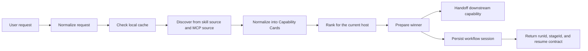

# skills-broker

[](https://github.com/monkeyin92/skills-broker/actions/workflows/ci.yml)
[](./LICENSE)
[](https://github.com/monkeyin92/skills-broker/stargazers)

**English** | [简体中文](./README.zh-CN.md)

> Stop making users remember skill names.  
> Let them ask for outcomes. Let the broker find the right capability.

`skills-broker` is an open-source **skill router**, **MCP router**, and **agent capability broker** for code-native agent hosts such as **Claude Code**, **Codex**, and **OpenCode**. **Claude Code, Codex, and OpenCode now share full published lifecycle and proof/reuse parity.**

Instead of forcing users to browse catalogs, memorize tool names, or manually decide which capability to install next, `skills-broker` sits in front of the host and handles the capability decision at runtime.

The clearest first-use path today is **website QA**:

- ask the host to QA a website
- let the broker surface `INSTALL_REQUIRED` if the winner is missing
- retry after install and watch the same path verify and reuse across Claude Code, Codex, and OpenCode

If this problem resonates with you, a star helps more people discover the project.

## The Problem

The skill ecosystem is growing fast, but the UX is still backwards:

- users have to remember tool names instead of describing outcomes
- teams slowly accumulate too many installed skills
- context windows get polluted by capabilities that are rarely needed
- agents often assume the right capability is already installed locally
- "discovery" and "execution" are still treated as separate worlds

The result is simple:

**finding the right skill is often harder than using it.**

## The Idea

`skills-broker` is not another marketplace.

It is the missing **decision layer** between:

- what the user wants
- what the host can call
- what the capability ecosystem currently offers

The user says:

> "turn this webpage into markdown"

The broker decides:

1. what task family this request belongs to
2. whether a known-good local winner can be reused
3. which skill or MCP candidate best fits the current host
4. how to prepare that candidate until it becomes callable
5. when to hand off and stop

That keeps the user focused on the outcome, not on the catalog.

## Why People Care

### Without a broker

- users browse skills and registries manually
- agents guess capability names
- local installs keep growing
- one broken discovery source can collapse the whole path
- every request starts capability discovery from scratch

### With `skills-broker`

- users express intent in natural language
- the broker checks local cache first
- skills and MCP entries are normalized into one decision model
- the current host is treated as a hard constraint
- handoff is explicit and bounded

## Manual Discovery vs `skills-broker`

| Problem | Manual skill hunting | With `skills-broker` |
|---|---|---|
| How work starts | User searches catalogs | User describes the outcome |
| Capability choice | Human guesses | Broker ranks candidates |
| Local reuse | Usually ad hoc | Cache-first by design |
| Skill vs MCP | Separate mental models | One normalized `Capability Card` model |
| Failure handling | Easy to break the whole path | Single-source failure can degrade gracefully |
| Context cost | Tends to grow over time | Broker prefers the minimum useful capability |
| User focus | Tool names and setup | Task outcome |

## What v0 Does Today

Current scope is intentionally narrow:

> **A small first lake for the broker auto-router:** markdown conversions, broker-first requirements / QA / investigation routing, and one broker-owned `idea-to-ship` workflow.

Within that lake, **website QA is the clearest default-entry lane today**. Requirements analysis and investigation remain supported maintained families, but QA is the first workflow the docs should teach people to try.

The second proven family is **web markdown**. It is the next operator loop to run after website QA, not a competing first move.
The next proven family is **social markdown**. It should show up after web markdown as another maintained loop, not as a new first move.

v0 currently includes:

- a shared broker envelope across hosts
- broker-side normalization for:
  - `web_content_to_markdown`
  - `social_post_to_markdown`
  - raw `requirements_analysis`
  - raw website `qa`
  - raw `investigation`
  - `capability_discovery_or_install`
- broker-owned workflow start + resume for `idea-to-ship`
- dual-source discovery
  - host skill catalog
  - MCP-backed capability candidates
- shared `Capability Card` normalization
- cache-first routing
- daily first-use refresh plus hard TTL
- deterministic ranking with explanations
- workflow runtime with `runId` + `stageId` + `decision`
- explicit artifact and gate contracts for workflow stages
- prepare + handoff for downstream capabilities, or persist + return stage state for broker-owned workflows
- structured outcomes for unsupported, ambiguous, and no-candidate requests
- structured workflow failures for stale stage, missing/invalid artifacts, install-required, and ship-gate blocks
- relocatable Claude Code plugin package
- published `npx skills-broker` lifecycle CLI
- shared broker home install/update/remove/doctor flow
- Claude Code, Codex, and OpenCode thin host shell support
- cross-host cache reuse across Claude Code, Codex, and OpenCode
- verified downstream manifests as an advisory discovery source for already-proven broker-owned downstream winners
- CI and live discovery smoke coverage
- capability-query-led host-catalog, MCP, and workflow discovery, so structured broker requests are less tightly coupled to exact legacy `intent` equality
- validated MCP registry metadata plus query-coverage evidence, so MCP candidates can explain version, transport, endpoint count, and why they matched without outranking installed/local winners
- query-first normalization for modern web, social, and capability-discovery requests, so `capabilityQuery` now carries the primary broker semantics and `intent` mainly remains as a compatibility lane
- shared-home routing trace persistence plus `skills-broker doctor` rollups for hit / misroute / fallback rates across `structured_query`, `raw_envelope`, and `legacy_task` request surfaces
- repo-scoped canonical `STATUS.md` proof checks in `skills-broker doctor`, including strict shipped-local versus shipped-remote evaluation for CI or release gates

This slice now also catches more free-form product-idea phrasing, so a natural sentence is more likely to start the broker-owned `idea-to-ship` workflow instead of falling through as unsupported.

Important truth in this packet: the catalog still carries a `capability-discovery` helper identity, but today that path is a broker-guided discovery/install helper contract implemented as a local helper skill, not a full broker-owned acquisition workflow. In v0, the shipped broker-owned workflows are now `idea-to-ship` and `investigation-to-fix`.

This is deliberately not "solve everything."  
The point of v0 is to prove that a broker can pick and prepare the right capability better than a human manually browsing skills.

**Current product phase:** keep adoption health green while turning discovery/install into a stronger reuse flywheel, expanding the evidence-backed capability surface, and protecting the now-full-parity Claude Code / Codex / OpenCode runtime with explicit CI trust guardrails. The first default-entry habit this packet still wants to make obvious is website QA.

**Migration note:** `capabilityQuery` is now the only public request contract the broker wants callers to depend on. `intent` still exists, but it now survives only as an internal compatibility lane label for supplier adapters, explicit late tie-breaks, maintained-family proof rails, and legacy workflow/session continuity.

**Active DX bar for this packet:** make the supported-host truth obvious, get to first routed success in under 5 minutes, and make operator-facing failures point at problem, cause, and fix.

## Architecture At A Glance



## Shared Broker Home

The shared-home architecture is now actively implemented in this repository:

- install `skills-broker` once
- keep the shared broker home at `~/.skills-broker/`
- let Claude Code, Codex, and OpenCode attach through thin host shells
- share capability cards, routing history, cache, and runtime state across hosts

That means switching hosts should not reset discovery quality.

If a user first proves a strong winner in Claude Code and later starts using Codex or OpenCode, the broker should reuse the same shared knowledge instead of rediscovering from zero.

The product-level maintenance command for this model is:

```bash
npx skills-broker update
```

Its job is meant to be:

- update the shared broker runtime and config under `~/.skills-broker/`
- rescan supported hosts
- install missing thin host shells for newly detected hosts
- repair existing host shells when needed
- preserve cache, capability history, and successful routing records by default

## Current Support Matrix

- Supported now: Claude Code, Codex, OpenCode
- Claude Code, Codex, and OpenCode now share full published lifecycle and proof/reuse parity.
- Published lifecycle commands: npx skills-broker update / npx skills-broker doctor / npx skills-broker remove
- All supported hosts now share the same shared broker home, thin host shell, proof/reuse state, and published lifecycle contract.
- Not supported in v0: other hosts

The explicit third-host readiness contract in `docs/superpowers/specs/2026-04-22-third-host-thin-shell-readiness.md` now serves as the historical record of the parity work that landed, plus a guardrail for future host expansion.

## Why It Is Different

`skills-broker` is **not**:

- a skill marketplace
- a content extraction engine
- a general chat app
- a prompt that hardcodes tool names

It is the layer that makes **runtime capability decisions**.

That distinction matters because the hardest part is not storing tools. The hardest part is choosing the right one, at the right time, for the right host, without polluting context or forcing users to become catalog experts.

## Quick Start

If you only try one published path, make it this one: install the shared broker home, ask the host to QA a website, approve `INSTALL_REQUIRED` if needed, then rerun the same request and inspect `doctor`.

This packet treats website QA as the QA default-entry loop and the fastest operator path to doctor truth. Other maintained lanes stay supported, but they are not the first move.

### 1. Install or refresh the shared broker home

```bash
npx skills-broker update
```

Use `npx skills-broker update` to initialize or refresh the shared broker home, attach thin host shells, and reuse the same routing cache across Claude Code, Codex, and OpenCode. The published lifecycle CLI now manages all three supported hosts. Bare `npx skills-broker` currently behaves the same as `npx skills-broker update`, so scripts and docs should spell the subcommand explicitly. `update` and `doctor` now also emit a first-class `adoptionHealth` verdict:

- `green`: at least one managed host is clean and the known proof surfaces are not red
- `blocked`: the install is present but a named blocker exists, such as competing peers, manual recovery, gate drift, or an explicit missing host shell
- `inactive`: no managed host is installed yet, but nothing is broken

`npx skills-broker update --repair-host-surface` records typed peer-surface repair events, and `npx skills-broker update --clear-manual-recovery --host <host> --marker-id <id> ...` is the explicit operator path for unblocking a host after a failed repair. `npx skills-broker doctor` inspects the environment without writing, summarizes recent broker hit / misroute / fallback rates when shared-home routing traces exist, reports both acquisition-memory reuse and verified downstream manifests as distinct advisory discovery sources, surfaces broker-first gate freshness plus manual-recovery blockers, and, inside repos that opt into a canonical `STATUS.md`, can also validate shipped-local versus shipped-remote proof state for strict CI gates. `npx skills-broker remove` detaches only the managed host shells by default, `npx skills-broker remove --reset-acquisition-memory` clears only the advisory acquisition-memory store, and `npx skills-broker remove --purge` fully removes the shared broker home.

By default, `update` detects official host roots before it writes anything:

- Claude Code: `~/.claude`, then installs the thin shell at `~/.claude/skills/skills-broker`
- Codex: `~/.codex`, then installs the thin shell at `~/.agents/skills/skills-broker`
- OpenCode: `~/.config/opencode` or `~/.opencode`, then installs the thin shell at `<detected-root>/skills/skills-broker`

If a host root is not found, the CLI will explain that and tell you to use `--claude-dir`, `--codex-dir`, or `--opencode-dir` for custom layouts. A missing default root keeps adoption health `inactive`; an explicitly targeted shell path that is missing shows up as a named `blocked` verdict.

### 2. Try the website QA install-required -> verify -> reuse loop

This is the published host-shell path where the discovery/install flywheel is supposed to prove itself.

1. In Claude Code, Codex, or OpenCode, start with a website QA request such as `QA this website https://example.com`.
2. If the best package is not installed yet, the host should receive an `INSTALL_REQUIRED` outcome with `hostAction=offer_package_install`. That is different from a true `NO_CANDIDATE`: the broker found a winner and is asking the host to install it.
3. Approve the install, then send the same request again. The broker should verify the installed winner and hand off instead of falling back.
4. Run `npx skills-broker doctor` to confirm the shared-home state is recording reuse and any verified downstream manifests that can be replayed later.

Requirements analysis and investigation are still supported maintained families. They just are not the first thing this README should make you try.

Web markdown is still a proven next lane, but only after the QA default-entry loop and doctor truth already feel clear.

Once that default-entry loop feels clear, the second proven family is **web markdown**: ask for something like `turn this webpage into markdown https://example.com/post`, approve the install if needed, rerun the same request, then repeat it from the other host to prove cross-host reuse.

The next proven family is **social markdown**: ask for something like `save this X post as markdown https://x.com/example/status/1`, approve the install if needed, rerun the same request, then repeat it from another supported host to prove the same cross-host reuse contract.

On the first blocked pass, the host-side outcome should look like:

```json
{
  "outcome": {
    "code": "INSTALL_REQUIRED",
    "hostAction": "offer_package_install"
  }
}
```

After the first verified reuse, `doctor` should include a line like:

```text
Acquisition memory: present, entries=2, successful_routes=3, first_reuse_after_install=1, cross_host_reuse=1
Verified downstream manifests: total=2, claude-code=1, codex=1
```

If you later clear acquisition memory, a verified downstream manifest from one host should still be enough for another host to recover `INSTALL_REQUIRED` instead of falling all the way back to `NO_CANDIDATE`.

If you want to clear only that advisory memory and re-run the loop from scratch, use:

```bash
npx skills-broker remove --reset-acquisition-memory
```

### 3. Verify the operator path with `doctor`

```bash
npx skills-broker doctor --strict
```

This is the fastest way to confirm the shared-home install is real after the QA loop. For this packet, the success bar is simple:

- you can tell in one command whether adoption health is `green`, `blocked`, or `inactive`
- the support matrix now claims Claude Code, Codex, and OpenCode with full lifecycle / proof parity, and the operator-facing docs say the same thing
- operator-facing failures tell you what broke and what to inspect next

### 4. Try explicit shared-home directories

```bash
npx skills-broker update \
  --broker-home /tmp/.skills-broker \
  --claude-dir /tmp/.claude/skills/skills-broker \
  --codex-dir /tmp/.agents/skills/skills-broker \
  --opencode-dir /tmp/.config/opencode/skills/skills-broker
```

This will:

- build the shared broker runtime into `/tmp/.skills-broker`
- attach a Claude Code thin shell
- attach a Codex thin shell
- attach an OpenCode thin shell
- let both hosts reuse the same broker cache and routing history

For automation or CI, every lifecycle command also supports `--json`. For the published family-proof loops, prefer reading `familyProofs.website_qa.verdict` for the default-entry lane and `familyProofs.web_content_to_markdown.verdict` for the second proven lane:

- `blocked`: proof rails are unreadable or the loop is otherwise not trustworthy yet
- `in_progress`: the loop has started, but install -> verify -> cross-host reuse is not fully proven
- `proven`: the loop has reached cross-host reuse proof

`familyProofs.<family>.phase` and `familyProofs.<family>.proofs` remain available when a caller needs more detail, but consumers should not have to parse the human-readable doctor text.

### 5. Clone the repository for local development

```bash
git clone https://github.com/monkeyin92/skills-broker.git
cd skills-broker
npm ci
```

### 6. Preflight and verify the local checkout

```bash
# CI-aligned local baseline: Node 22 + npm ci + npm run build + npm test
npm run verify:local
```

Use `npm run verify:local -- --check-only` when you want the deterministic preflight without starting the suite. If the preflight reports a broken npm / Rollup / Vitest state, run `npm ci`, rerun `npm run verify:local -- --check-only`, and then rerun `npm run verify:local` once the health check is green.

`verify:local` intentionally answers a different question than the CI trust guards. `npm run verify:local` checks whether this machine is healthy enough to run the baseline Node 22 + build + test loop. CI then runs `npm run ci:blind-spot`, `npm run test:ci:narrative-parity`, and the strict repo-scoped doctor gate to catch drift in supported hosts, maintained/proven lanes, workflow coverage, and operator-facing narrative truth.

For repo-owned shipping truth, run `npm run release:gate -- --json` before publish. It replays the blind-spot report, the focused narrative parity suite, and the strict repo-scoped doctor gate as one canonical verdict with the failing rail, evaluated shipping ref, and remote-freshness diagnostics. After the shipping ref contains `HEAD`, run `npm run release:promote -- --ship-ref origin/main --json` to upgrade only the eligible canonical `STATUS.md` items from `shipped_local` to `shipped_remote`. Both commands stay repo-local on purpose; they do not widen the published lifecycle CLI beyond `npx skills-broker update / doctor / remove`.

### 7. Install the repo-local Claude Code package

```bash
./scripts/install-claude-code.sh /absolute/path/to/claude-code-plugin
```

This creates a self-contained local package containing:

- `.claude-plugin/plugin.json`
- `skills/skills-broker/SKILL.md`
- `config/*.json`
- `dist/*.js`
- `package.json`
- `bin/run-broker`

This is the **repo-local Claude Code development path**, not the primary published install flow.

### 8. First routed success on the contributor path

```bash
/absolute/path/to/claude-code-plugin/bin/run-broker \
  '{"requestText":"turn this webpage into markdown: https://example.com/article","host":"claude-code","invocationMode":"explicit","urls":["https://example.com/article"]}'
```

Expected output: a JSON payload containing the selected winner, handoff envelope, and debug information. This is the contributor path, not the published host-shell path.

## Example Use Cases

- route a "turn this webpage into markdown" request without making the user choose a skill name first
- reuse a previously successful local capability instead of rediscovering from scratch
- compare host-native skill candidates and MCP-backed candidates using one model
- keep the broker narrow and explicit while experimenting with dynamic capability discovery

## Why This Approach Wins

- **Lower discovery cost**  
  Users describe the task, not the skill name.

- **Smaller context footprint**  
  The broker prefers the minimum capability that can actually solve the task.

- **Better failure tolerance**  
  One failing discovery source does not need to kill the entire routing flow.

- **Host-aware routing**  
  Current-host support is a hard filter. Cross-host portability is a bonus, not a fantasy.

- **Clear behavioral boundary**  
  The broker does not invent extra work such as summaries the user never asked for.

- **Relocatable install output**  
  The generated Claude Code package can move independently of the original checkout.

## Who This Is For

This project is especially relevant if you are:

- building agent tooling on top of Claude Code, Codex, or OpenCode today
- frustrated by skill sprawl and context bloat
- experimenting with MCP-backed capability ecosystems
- trying to make agents feel more outcome-driven than tool-driven
- designing a runtime layer for dynamic capability discovery

## Current Limits

This repository currently optimizes for:

- a small first routed lake instead of broad open-domain coverage
- three supported thin hosts today: Claude Code, Codex, and OpenCode
- one clean default-entry habit inside that lake: website QA first
- a handful of explicit broker-first lanes: markdown conversion, requirements / QA / investigation, and the first workflow recipe
- explicit fixture-backed local tests
- small, inspectable routing logic

It does **not** yet provide:

- full parity for hosts beyond Claude Code, Codex, and OpenCode
- broad auto-routing beyond clearly external capability requests
- broad open-domain task coverage
- live network discovery as the default runtime path
- consistently strong broker-first hit rate across real host sessions

## Roadmap

Likely next:

- stronger broker-first hit rate in real Claude Code and Codex sessions
- more proof that website QA-first positioning turns into real repeat usage
- CI guardrails that keep shipped lifecycle / proof truth from drifting
- broader host support beyond the current three-host set
- richer host-side observability around broker first-refusal decisions
- more task families beyond the current markdown + requirements / QA / investigation lake
- more broker-owned workflow recipes beyond the first `idea-to-ship` path
- stronger live registry integration
- richer attachment-aware normalization and clarifying-question flows

## Repository Structure

```text
src/
  broker/                 routing, ranking, prepare, handoff
  core/                   request types, capability cards, cache policy
  hosts/claude-code/      Claude Code adapter and installer
  hosts/codex/            Codex thin-shell adapter and installer
  hosts/opencode/         OpenCode thin-shell adapter and installer
  shared-home/            shared broker home install/update flow
  sources/                skill and MCP discovery adapters
tests/
  cli/                    CLI contract tests
  core/                   request and cache tests
  broker/                 ranking, prepare, handoff tests
  integration/            end-to-end broker pipeline tests
  e2e/                    shared-home and cross-host smoke tests
config/
  host-skills.seed.json
  mcp-registry.seed.json
scripts/
  install-claude-code.sh
  update-shared-home.sh
```

## Contributing

Contributions are welcome.

Strong contribution areas:

- CI guardrails for lifecycle / proof truth
- broader host shells beyond OpenCode
- live discovery integrations
- new task families
- richer ranking signals
- install and packaging UX
- examples, docs, and demos

Use the templates when contributing:

- [Bug report](https://github.com/monkeyin92/skills-broker/issues/new?template=bug_report.md)
- [Feature request](https://github.com/monkeyin92/skills-broker/issues/new?template=feature_request.md)
- [Pull request template](./.github/pull_request_template.md)

Before opening a PR:

```bash
npm run build
npx vitest run
```

If your change affects behavior, please explain:

- the user problem
- why the broker should own that behavior
- how the handoff boundary stays clean

## FAQ

### Is this a marketplace?

No. It is a broker and routing layer.

### Is this production-ready?

Not yet. It is still a focused v0, but it now includes a shared broker home, published lifecycle CLI, full-parity thin shells for Claude Code, Codex, and OpenCode, a shipped adoption-proof rail, and a small first routed lake. The current phase is keeping real host auto-routing green while expanding the capability surface and CI trust rails. If you want the clearest first-use path today, start with website QA.

### Why did Claude Code and Codex come first, and where does OpenCode fit now?

Because the product first had to prove one shared broker contract across real code-native hosts before expanding further. Claude Code and Codex were the first two hosts on that path; OpenCode is now the shipped third thin host shell under the same full lifecycle / proof parity contract.

### Will Claude Code, Codex, and OpenCode share the same capability knowledge?

Yes. The repository now includes a shared-home flow so that Claude Code, Codex, and OpenCode can reuse the same capability cache, history, and runtime instead of each building their own isolated copy.

### What is `npx skills-broker update` supposed to do?

It is the current product-level maintenance command for the shared-home model. It updates the shared runtime, rescans known hosts, and installs or repairs thin host shells without wiping existing broker knowledge by default.

### Why not just install more skills?

Because more installed skills usually increase selection cost, context cost, and conflict risk. The point of a broker is to choose less, not to accumulate more.

### How is this different from an MCP registry?

A registry tells you what exists. `skills-broker` decides what should be used right now for the current host and task, and its MCP source now carries validated version / transport / query-coverage metadata so the broker can explain MCP picks without letting advisory registry candidates outrank installed local winners.

### Can it work without live network discovery?

Yes. v0 relies on local seed and fixture data for its default test and development path.

## License

[MIT](./LICENSE)
