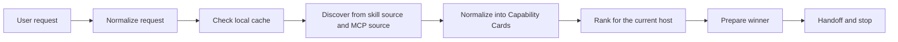

# skills-broker

[](https://github.com/monkeyin92/skills-broker/actions/workflows/ci.yml)
[](./LICENSE)
[](https://github.com/monkeyin92/skills-broker/stargazers)

**English** | [简体中文](./README.zh-CN.md)

> Stop making users remember skill names.  
> Let them ask for outcomes. Let the broker find the right capability.

`skills-broker` is an open-source **skill router**, **MCP router**, and **agent capability broker** for code-native agent hosts such as **Claude Code**, **Codex**, and **OpenCode**.

Instead of forcing users to browse catalogs, memorize tool names, or manually decide which capability to install next, `skills-broker` sits in front of the host and handles the capability decision at runtime.

If this problem resonates with you, a star helps more people discover the project.

## The Problem

The skill ecosystem is growing fast, but the UX is still backwards:

- users have to remember tool names instead of describing outcomes
- teams slowly accumulate too many installed skills
- context windows get polluted by capabilities that are rarely needed
- agents often assume the right capability is already installed locally
- "discovery" and "execution" are still treated as separate worlds

The result is simple:

**finding the right skill is often harder than using it.**

## The Idea

`skills-broker` is not another marketplace.

It is the missing **decision layer** between:

- what the user wants
- what the host can call
- what the capability ecosystem currently offers

The user says:

> "turn this webpage into markdown"

The broker decides:

1. what task family this request belongs to
2. whether a known-good local winner can be reused
3. which skill or MCP candidate best fits the current host
4. how to prepare that candidate until it becomes callable
5. when to hand off and stop

That keeps the user focused on the outcome, not on the catalog.

## Why People Care

### Without a broker

- users browse skills and registries manually
- agents guess capability names
- local installs keep growing
- one broken discovery source can collapse the whole path
- every request starts capability discovery from scratch

### With `skills-broker`

- users express intent in natural language
- the broker checks local cache first
- skills and MCP entries are normalized into one decision model
- the current host is treated as a hard constraint
- handoff is explicit and bounded

## Manual Discovery vs `skills-broker`

| Problem | Manual skill hunting | With `skills-broker` |
|---|---|---|
| How work starts | User searches catalogs | User describes the outcome |
| Capability choice | Human guesses | Broker ranks candidates |
| Local reuse | Usually ad hoc | Cache-first by design |
| Skill vs MCP | Separate mental models | One normalized `Capability Card` model |
| Failure handling | Easy to break the whole path | Single-source failure can degrade gracefully |
| Context cost | Tends to grow over time | Broker prefers the minimum useful capability |
| User focus | Tool names and setup | Task outcome |

## What v0 Does Today

Current scope is intentionally narrow:

> **Claude Code-first broker for one workflow:** `webpage -> markdown`

v0 currently includes:

- dual-source discovery
  - host skill catalog
  - MCP-backed capability candidates
- shared `Capability Card` normalization
- cache-first routing
- daily first-use refresh plus hard TTL
- deterministic ranking with explanations
- prepare + handoff boundary
- relocatable Claude Code plugin package
- CI and live discovery smoke coverage

This is deliberately not "solve everything."  
The point of v0 is to prove that a broker can pick and prepare the right capability better than a human manually browsing skills.

## Architecture At A Glance



## Why It Is Different

`skills-broker` is **not**:

- a skill marketplace
- a content extraction engine
- a general chat app
- a prompt that hardcodes tool names

It is the layer that makes **runtime capability decisions**.

That distinction matters because the hardest part is not storing tools. The hardest part is choosing the right one, at the right time, for the right host, without polluting context or forcing users to become catalog experts.

## Quick Start

### 1. Clone and install dependencies

```bash
git clone https://github.com/monkeyin92/skills-broker.git
cd skills-broker
npm ci
```

### 2. Build and verify

```bash
npm run build
npx vitest run
```

### 3. Install the local Claude Code plugin package

```bash
./scripts/install-claude-code.sh /absolute/path/to/claude-code-plugin
```

This creates a self-contained local package containing:

- `.claude-plugin/plugin.json`
- `skills/webpage-to-markdown/SKILL.md`
- `config/*.json`
- `dist/*.js`
- `package.json`
- `bin/run-broker`

### 4. Try the installed runner

```bash
/absolute/path/to/claude-code-plugin/bin/run-broker \
  '{"task":"turn this webpage into markdown","url":"https://example.com/article"}'
```

Expected output: a JSON payload containing the selected winner, handoff envelope, and debug information.

## Example Use Cases

- route a "turn this webpage into markdown" request without making the user choose a skill name first
- reuse a previously successful local capability instead of rediscovering from scratch
- compare host-native skill candidates and MCP-backed candidates using one model
- keep the broker narrow and explicit while experimenting with dynamic capability discovery

## Why This Approach Wins

- **Lower discovery cost**  
  Users describe the task, not the skill name.

- **Smaller context footprint**  
  The broker prefers the minimum capability that can actually solve the task.

- **Better failure tolerance**  
  One failing discovery source does not need to kill the entire routing flow.

- **Host-aware routing**  
  Current-host support is a hard filter. Cross-host portability is a bonus, not a fantasy.

- **Clear behavioral boundary**  
  The broker does not invent extra work such as summaries the user never asked for.

- **Relocatable install output**  
  The generated Claude Code package can move independently of the original checkout.

## Who This Is For

This project is especially relevant if you are:

- building agent tooling on top of Claude Code, Codex, or OpenCode
- frustrated by skill sprawl and context bloat
- experimenting with MCP-backed capability ecosystems
- trying to make agents feel more outcome-driven than tool-driven
- designing a runtime layer for dynamic capability discovery

## Current Limits

This repository currently optimizes for:

- one host first: Claude Code
- one task family first: `webpage -> markdown`
- explicit fixture-backed local tests
- small, inspectable routing logic

It does **not** yet provide:

- a published `npm` package for end users
- a general multi-host installation flow
- broad open-domain task coverage
- live network discovery as the default runtime path

## Roadmap

Likely next:

- Codex adapter after the Claude Code path is stable
- broader host support such as OpenCode
- more task families beyond `webpage -> markdown`
- stronger live registry integration
- a simpler end-user install flow through `npm` or `npx`

## Repository Structure

```text
src/
  broker/                 routing, ranking, prepare, handoff
  core/                   request types, capability cards, cache policy
  hosts/claude-code/      Claude Code adapter and installer
  sources/                skill and MCP discovery adapters
tests/
  cli/                    CLI contract tests
  core/                   request and cache tests
  broker/                 ranking, prepare, handoff tests
  integration/            end-to-end broker pipeline tests
  e2e/                    Claude Code plugin smoke test
config/
  host-skills.seed.json
  mcp-registry.seed.json
scripts/
  install-claude-code.sh
```

## Contributing

Contributions are welcome.

Strong contribution areas:

- host adapters for Codex and OpenCode
- live discovery integrations
- new task families
- richer ranking signals
- install and packaging UX
- examples, docs, and demos

Use the templates when contributing:

- [Bug report](https://github.com/monkeyin92/skills-broker/issues/new?template=bug_report.md)
- [Feature request](https://github.com/monkeyin92/skills-broker/issues/new?template=feature_request.md)
- [Pull request template](./.github/pull_request_template.md)

Before opening a PR:

```bash
npm run build
npx vitest run
```

If your change affects behavior, please explain:

- the user problem
- why the broker should own that behavior
- how the handoff boundary stays clean

## FAQ

### Is this a marketplace?

No. It is a broker and routing layer.

### Is this production-ready?

Not yet. It is a focused v0 with one host and one workflow.

### Why Claude Code first?

Because v0 needs one concrete host to prove the broker contract end to end before expanding to more hosts.

### Why not just install more skills?

Because more installed skills usually increase selection cost, context cost, and conflict risk. The point of a broker is to choose less, not to accumulate more.

### How is this different from an MCP registry?

A registry tells you what exists. `skills-broker` decides what should be used right now for the current host and task.

### Can it work without live network discovery?

Yes. v0 relies on local seed and fixture data for its default test and development path.

## License

[MIT](./LICENSE)
