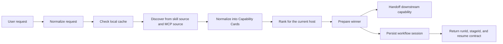

# skills-broker

[](https://github.com/monkeyin92/skills-broker/actions/workflows/ci.yml)
[](./LICENSE)
[](https://github.com/monkeyin92/skills-broker/stargazers)

**English** | [简体中文](./README.zh-CN.md)

> Stop making users remember skill names.  
> Let them ask for outcomes. Let the broker find the right capability.

`skills-broker` is an open-source **skill router**, **MCP router**, and **agent capability broker** for code-native agent hosts such as **Claude Code**, **Codex**, and **OpenCode**.

Instead of forcing users to browse catalogs, memorize tool names, or manually decide which capability to install next, `skills-broker` sits in front of the host and handles the capability decision at runtime.

If this problem resonates with you, a star helps more people discover the project.

## The Problem

The skill ecosystem is growing fast, but the UX is still backwards:

- users have to remember tool names instead of describing outcomes
- teams slowly accumulate too many installed skills
- context windows get polluted by capabilities that are rarely needed
- agents often assume the right capability is already installed locally
- "discovery" and "execution" are still treated as separate worlds

The result is simple:

**finding the right skill is often harder than using it.**

## The Idea

`skills-broker` is not another marketplace.

It is the missing **decision layer** between:

- what the user wants
- what the host can call
- what the capability ecosystem currently offers

The user says:

> "turn this webpage into markdown"

The broker decides:

1. what task family this request belongs to
2. whether a known-good local winner can be reused
3. which skill or MCP candidate best fits the current host
4. how to prepare that candidate until it becomes callable
5. when to hand off and stop

That keeps the user focused on the outcome, not on the catalog.

## Why People Care

### Without a broker

- users browse skills and registries manually
- agents guess capability names
- local installs keep growing
- one broken discovery source can collapse the whole path
- every request starts capability discovery from scratch

### With `skills-broker`

- users express intent in natural language
- the broker checks local cache first
- skills and MCP entries are normalized into one decision model
- the current host is treated as a hard constraint
- handoff is explicit and bounded

## Manual Discovery vs `skills-broker`

| Problem | Manual skill hunting | With `skills-broker` |
|---|---|---|
| How work starts | User searches catalogs | User describes the outcome |
| Capability choice | Human guesses | Broker ranks candidates |
| Local reuse | Usually ad hoc | Cache-first by design |
| Skill vs MCP | Separate mental models | One normalized `Capability Card` model |
| Failure handling | Easy to break the whole path | Single-source failure can degrade gracefully |
| Context cost | Tends to grow over time | Broker prefers the minimum useful capability |
| User focus | Tool names and setup | Task outcome |

## What v0 Does Today

Current scope is intentionally narrow:

> **A small first lake for the broker auto-router:** markdown conversions, broker-first requirements / QA / investigation routing, and one broker-owned `idea-to-ship` workflow.

v0 currently includes:

- a shared broker envelope across hosts
- broker-side normalization for:
  - `web_content_to_markdown`
  - `social_post_to_markdown`
  - raw `requirements_analysis`
  - raw website `qa`
  - raw `investigation`
  - `capability_discovery_or_install`
- broker-owned workflow start + resume for `idea-to-ship`
- dual-source discovery
  - host skill catalog
  - MCP-backed capability candidates
- shared `Capability Card` normalization
- cache-first routing
- daily first-use refresh plus hard TTL
- deterministic ranking with explanations
- workflow runtime with `runId` + `stageId` + `decision`
- explicit artifact and gate contracts for workflow stages
- prepare + handoff for downstream capabilities, or persist + return stage state for broker-owned workflows
- structured outcomes for unsupported, ambiguous, and no-candidate requests
- structured workflow failures for stale stage, missing/invalid artifacts, install-required, and ship-gate blocks
- relocatable Claude Code plugin package
- published `npx skills-broker` lifecycle CLI
- shared broker home install/update/remove/doctor flow
- Claude Code and Codex thin host shell support
- cross-host cache reuse between Claude Code and Codex
- CI and live discovery smoke coverage
- capability-query-led host-catalog, MCP, and workflow discovery, so structured broker requests are less tightly coupled to exact legacy `intent` equality
- query-first normalization for modern web, social, and capability-discovery requests, so `capabilityQuery` now carries the primary broker semantics and `intent` mainly remains as a compatibility lane
- shared-home routing trace persistence plus `skills-broker doctor` rollups for hit / misroute / fallback rates across `structured_query`, `raw_envelope`, and `legacy_task` request surfaces

This slice now also catches more free-form product-idea phrasing, so a natural sentence is more likely to start the broker-owned `idea-to-ship` workflow instead of falling through as unsupported.

This is deliberately not "solve everything."  
The point of v0 is to prove that a broker can pick and prepare the right capability better than a human manually browsing skills.

**Current product phase:** improve real host auto-routing hit rate, so Claude Code and Codex ask the broker first for obvious external-capability work instead of leaving the broker installed-but-ignored.

## Architecture At A Glance



## Shared Broker Home

The shared-home architecture is now actively implemented in this repository:

- install `skills-broker` once
- keep the shared broker home at `~/.skills-broker/`
- let Claude Code, Codex, and future hosts attach through thin host shells
- share capability cards, routing history, cache, and runtime state across hosts

That means switching hosts should not reset discovery quality.

If a user first proves a strong winner in Claude Code and later starts using Codex, the broker should reuse the same shared knowledge instead of rediscovering from zero.

The product-level maintenance command for this model is intended to be:

```bash
skills-broker update
```

Its job is meant to be:

- update the shared broker runtime and config under `~/.skills-broker/`
- rescan supported hosts
- install missing thin host shells for newly detected hosts
- repair existing host shells when needed
- preserve cache, capability history, and successful routing records by default

## Why It Is Different

`skills-broker` is **not**:

- a skill marketplace
- a content extraction engine
- a general chat app
- a prompt that hardcodes tool names

It is the layer that makes **runtime capability decisions**.

That distinction matters because the hardest part is not storing tools. The hardest part is choosing the right one, at the right time, for the right host, without polluting context or forcing users to become catalog experts.

## Quick Start

### 1. Install or refresh the shared broker home

```bash
npx skills-broker update
```

Use `npx skills-broker update` to initialize or refresh the shared broker home, attach thin host shells, and reuse the same routing cache across Claude Code and Codex. `npx skills-broker doctor` inspects the environment without writing and now summarizes recent broker hit / misroute / fallback rates when shared-home routing traces exist, `npx skills-broker remove` detaches only the managed host shells by default, and `npx skills-broker remove --purge` fully removes the shared broker home.

By default, `update` detects official host roots before it writes anything:

- Claude Code: `~/.claude`, then installs the thin shell at `~/.claude/skills/skills-broker`
- Codex: `~/.codex`, then installs the thin shell at `~/.agents/skills/skills-broker`

If a host root is not found, the CLI will explain that and tell you to use `--claude-dir` or `--codex-dir` for custom layouts.

### 2. Try explicit shared-home directories

```bash
npx skills-broker update \
  --broker-home /tmp/.skills-broker \
  --claude-dir /tmp/.claude/skills/skills-broker \
  --codex-dir /tmp/.agents/skills/skills-broker
```

This will:

- build the shared broker runtime into `/tmp/.skills-broker`
- attach a Claude Code thin shell
- attach a Codex thin shell
- let both hosts reuse the same broker cache and routing history

For automation or CI, every lifecycle command also supports `--json`.

### 3. Clone the repository for local development

```bash
git clone https://github.com/monkeyin92/skills-broker.git
cd skills-broker
npm ci
```

### 4. Build and verify the local checkout

```bash
npm run build
npx vitest run
```

### 5. Install the repo-local Claude Code package

```bash
./scripts/install-claude-code.sh /absolute/path/to/claude-code-plugin
```

This creates a self-contained local package containing:

- `.claude-plugin/plugin.json`
- `skills/skills-broker/SKILL.md`
- `config/*.json`
- `dist/*.js`
- `package.json`
- `bin/run-broker`

This is the **repo-local Claude Code development path**, not the primary published install flow.

### 6. Try the installed runner

```bash
/absolute/path/to/claude-code-plugin/bin/run-broker \
  '{"requestText":"turn this webpage into markdown: https://example.com/article","host":"claude-code","invocationMode":"explicit","urls":["https://example.com/article"]}'
```

Expected output: a JSON payload containing the selected winner, handoff envelope, and debug information.

## Example Use Cases

- route a "turn this webpage into markdown" request without making the user choose a skill name first
- reuse a previously successful local capability instead of rediscovering from scratch
- compare host-native skill candidates and MCP-backed candidates using one model
- keep the broker narrow and explicit while experimenting with dynamic capability discovery

## Why This Approach Wins

- **Lower discovery cost**  
  Users describe the task, not the skill name.

- **Smaller context footprint**  
  The broker prefers the minimum capability that can actually solve the task.

- **Better failure tolerance**  
  One failing discovery source does not need to kill the entire routing flow.

- **Host-aware routing**  
  Current-host support is a hard filter. Cross-host portability is a bonus, not a fantasy.

- **Clear behavioral boundary**  
  The broker does not invent extra work such as summaries the user never asked for.

- **Relocatable install output**  
  The generated Claude Code package can move independently of the original checkout.

## Who This Is For

This project is especially relevant if you are:

- building agent tooling on top of Claude Code, Codex, or OpenCode
- frustrated by skill sprawl and context bloat
- experimenting with MCP-backed capability ecosystems
- trying to make agents feel more outcome-driven than tool-driven
- designing a runtime layer for dynamic capability discovery

## Current Limits

This repository currently optimizes for:

- a small first routed lake instead of broad open-domain coverage
- two attached hosts first: Claude Code and Codex
- a handful of explicit broker-first lanes: markdown conversion, requirements / QA / investigation, and the first workflow recipe
- explicit fixture-backed local tests
- small, inspectable routing logic

It does **not** yet provide:

- OpenCode host-shell support
- broad auto-routing beyond clearly external capability requests
- broad open-domain task coverage
- live network discovery as the default runtime path
- consistently strong broker-first hit rate across real host sessions

## Roadmap

Likely next:

- stronger broker-first hit rate in real Claude Code and Codex sessions
- broader host support such as OpenCode
- richer host-side observability around broker first-refusal decisions
- more task families beyond the current markdown + requirements / QA / investigation lake
- more broker-owned workflow recipes beyond the first `idea-to-ship` path
- stronger live registry integration
- richer attachment-aware normalization and clarifying-question flows

## Repository Structure

```text
src/
  broker/                 routing, ranking, prepare, handoff
  core/                   request types, capability cards, cache policy
  hosts/claude-code/      Claude Code adapter and installer
  hosts/codex/            Codex thin-shell adapter and installer
  shared-home/            shared broker home install/update flow
  sources/                skill and MCP discovery adapters
tests/
  cli/                    CLI contract tests
  core/                   request and cache tests
  broker/                 ranking, prepare, handoff tests
  integration/            end-to-end broker pipeline tests
  e2e/                    Claude Code and shared-home smoke tests
config/
  host-skills.seed.json
  mcp-registry.seed.json
scripts/
  install-claude-code.sh
  update-shared-home.sh
```

## Contributing

Contributions are welcome.

Strong contribution areas:

- broader host shells such as OpenCode
- live discovery integrations
- new task families
- richer ranking signals
- install and packaging UX
- examples, docs, and demos

Use the templates when contributing:

- [Bug report](https://github.com/monkeyin92/skills-broker/issues/new?template=bug_report.md)
- [Feature request](https://github.com/monkeyin92/skills-broker/issues/new?template=feature_request.md)
- [Pull request template](./.github/pull_request_template.md)

Before opening a PR:

```bash
npm run build
npx vitest run
```

If your change affects behavior, please explain:

- the user problem
- why the broker should own that behavior
- how the handoff boundary stays clean

## FAQ

### Is this a marketplace?

No. It is a broker and routing layer.

### Is this production-ready?

Not yet. It is still a focused v0, but it now includes a shared broker home, published lifecycle CLI, Claude Code and Codex thin shells, and a small first routed lake. The current phase is improving real host auto-routing hit rate.

### Why Claude Code and Codex first?

Because the product first had to prove one shared broker contract across real code-native hosts before expanding further. Claude Code and Codex are the first two hosts on that path.

### Will Claude Code and Codex share the same capability knowledge?

Yes. The repository now includes an experimental shared-home flow so that Claude Code and Codex can reuse the same capability cache, history, and runtime instead of each building their own isolated copy.

### What is `skills-broker update` supposed to do?

It is the current product-level maintenance command for the shared-home model. It updates the shared runtime, rescans known hosts, and installs or repairs thin host shells without wiping existing broker knowledge by default.

### Why not just install more skills?

Because more installed skills usually increase selection cost, context cost, and conflict risk. The point of a broker is to choose less, not to accumulate more.

### How is this different from an MCP registry?

A registry tells you what exists. `skills-broker` decides what should be used right now for the current host and task.

### Can it work without live network discovery?

Yes. v0 relies on local seed and fixture data for its default test and development path.

## License

[MIT](./LICENSE)
