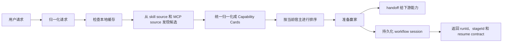

# skills-broker

[](https://github.com/monkeyin92/skills-broker/actions/workflows/ci.yml)
[](./LICENSE)
[](https://github.com/monkeyin92/skills-broker/stargazers)

[English](./README.md) | **简体中文**

> 别再让用户去记 skill 名字。  
> 让用户只说结果，让 broker 去找能力。

`skills-broker` 是一个面向 **Claude Code**、**Codex**、**OpenCode** 这类代码型 agent 宿主的开源 **skill router**、**MCP router**、**agent capability broker**。

它站在“用户请求”和“能力生态”之间，负责：

- 判断这次请求到底需不需要 skill 或 MCP
- 能复用本地已验证赢家时优先复用
- 需要外查时去选出最合适的候选
- 把候选准备到“宿主可调用”的状态
- handoff 完成立刻退场

如果你也被这个问题困扰，给项目点个 star 会很有帮助。

## 这个项目解决什么问题

现在的 skills 生态增长很快，但使用方式还是反着来的：

- 用户得先记住工具名，而不是先表达想要的结果
- 团队会一点点装越来越多的 skills
- 上下文被大量低频能力污染
- agent 常常默认能力已经安装在本地
- “发现能力”和“执行能力”还是割裂的

最后就会出现一个非常典型的现象：

**找 skill 的成本，经常比用 skill 还高。**

## 这个项目的核心想法

`skills-broker` 不是另一个 marketplace。

它是下面三者之间缺失的 **决策层**：

- 用户到底想解决什么
- 当前宿主到底能调用什么
- 当前生态里到底有什么能力可选

用户说：

> “把这个网页转成 markdown”

broker 决定：

1. 这个请求属于哪个任务族
2. 能不能直接复用本地已经验证过的赢家
3. 如果不能，该从 skill 和 MCP 候选里选哪个
4. 怎样把它准备到可调用状态
5. 到什么时机应该停止 broker、自觉 handoff

这样用户关心的是结果，不是工具目录。

## 为什么有人会关心它

### 没有 broker 时

- 用户自己翻目录
- agent 猜 skill 名
- 本地安装越来越多
- 一个 discovery source 出错可能整条链都坏
- 每次请求都要重新从头发现

### 有 broker 之后

- 用户只表达意图
- broker 先查本地缓存
- skills 和 MCP 都被统一成同一种决策模型
- 当前宿主是硬约束，不会瞎选
- handoff 明确，边界清晰

## 手动找能力 vs `skills-broker`

| 问题 | 手动找 skill / MCP | 使用 `skills-broker` |
|---|---|---|
| 起点 | 用户先翻目录 | 用户先表达结果 |
| 选能力 | 人来猜 | broker 来排 |
| 本地复用 | 通常靠经验 | cache-first 内建 |
| skill 与 MCP | 两套心智模型 | 统一成 `Capability Card` |
| 失败容错 | 很容易整条断掉 | 单源失败可降级继续 |
| 上下文成本 | 往往越装越多 | 偏向最少且足够好的能力 |
| 用户注意力 | 工具名和安装细节 | 任务结果 |

## v0 现在能做什么

当前版本故意做得很窄：

> **先打穿 broker auto-router 的一个小湖：** markdown 转换、broker-first 的需求分析 / QA / investigation 路由，以及第一条 broker 自管的 `idea-to-ship` workflow。

v0 当前包含：

- 一套跨宿主共享的 broker envelope
- broker 侧的归一化能力：
  - `web_content_to_markdown`
  - `social_post_to_markdown`
  - 原始 `requirements_analysis`
  - 原始网站 `qa`
  - 原始 `investigation`
  - `capability_discovery_or_install`
- `idea-to-ship` 的 broker 自管 workflow 启动与恢复
- 双来源发现
  - host skill catalog
  - MCP-backed capability candidates
- 统一的 `Capability Card` 归一化模型
- cache-first 路由
- 每日首次使用刷新 + 硬 TTL
- 可解释、可复现的确定性排序
- `runId` + `stageId` + `decision` 的 workflow runtime
- 显式的 stage artifact / gate contract
- 对普通下游能力走 prepare + handoff，对 broker 自管 workflow 走持久化 session + 返回当前 stage 状态
- `unsupported` / `ambiguous` / `no-candidate` 的结构化 outcome
- `stale stage`、缺失/非法 artifacts、`install_required`、`ship gate` 阻塞等 workflow 失败结果
- 可迁移的 Claude Code 插件安装产物
- 已发布的 `npx skills-broker` lifecycle CLI
- 共享 broker home 的 install / update / remove / doctor 链路
- Claude Code 和 Codex 薄宿主壳支持
- Claude Code 和 Codex 之间的跨宿主 cache 复用
- CI 和 live discovery smoke 覆盖
- capability-query 主导的 host catalog / MCP / workflow 发现，所以结构化 broker 请求不再那么依赖 legacy `intent` 的严格相等
- modern web / social / capability discovery 请求走 query-first 归一化，所以 `capabilityQuery` 现在承载主要 broker 语义，`intent` 更多只保留为兼容层标签
- shared home 会持久化 routing trace，`skills-broker doctor` 现在会按 `structured_query`、`raw_envelope`、`legacy_task` 输出最近命中率 / 误路由率 / fallback 率汇总

这一版也补宽了 free-form product idea 的命中面，所以用户用更自然的一句话描述产品想法时，更容易直接进入 broker 自管的 `idea-to-ship` workflow，而不是掉回 unsupported。

这不是为了“什么都支持”。  
v0 的目标是证明：在一个具体任务上，broker 可以比人手动翻 skills 更准确地选到并准备好正确能力。

**当前产品阶段：**先提升真实宿主里的 auto-routing 命中率，让 Claude Code 和 Codex 在遇到明显的外部能力请求时更稳定地先问 broker，而不是装上了却经常不用。

## 架构一眼看懂



## 共享 Broker Home

共享 home 架构已经开始在这个仓库里落地：

- `skills-broker` 只安装一次
- 共享 broker home 固定在 `~/.skills-broker/`
- Claude Code、Codex 以及后续宿主都只接一个很薄的 host shell
- capability cards、路由历史、缓存和运行时状态跨宿主共享

这意味着用户换宿主时，不应该把能力发现质量清零。

如果某个网页转 markdown 的赢家已经在 Claude Code 中被验证过，后续切到 Codex 时，broker 应该尽量复用同一份共享知识，而不是重新从零发现。

这个模型下，产品级统一维护命令定为：

```bash
skills-broker update
```

它的职责应该是：

- 更新 `~/.skills-broker/` 下的共享 runtime 和配置
- 重新扫描支持的宿主
- 给新检测到的宿主补装薄适配层
- 修复已有但损坏或缺失的宿主壳
- 默认保留 cache、capability history 和成功路由记录

## 它和别的东西本质上有什么不同

`skills-broker` **不是**：

- 一个 skill marketplace
- 一个网页抽取引擎
- 一个新的聊天产品
- 一个把工具名写死在 prompt 里的脚本

它真正负责的是 **运行时能力决策**。

这点很关键，因为最难的从来不是“把工具放进仓库里”，而是：  
**在正确的时机，为正确的宿主，为正确的任务，选到正确的能力，而且不让用户自己变成目录专家。**

## 快速安装和使用

### 1. 初始化或刷新共享 broker home

```bash
npx skills-broker update
```

使用 `npx skills-broker update` 可以初始化或刷新共享 broker home，接上薄宿主壳，并让 Claude Code 和 Codex 复用同一份路由缓存。`npx skills-broker doctor` 用来只读诊断环境，如果 shared home 里已经有 routing trace，还会顺手汇总最近的 broker 命中率 / 误路由率 / fallback 率；`npx skills-broker remove` 默认只拆卸受管宿主壳而不删除共享历史，`npx skills-broker remove --purge` 会把共享 broker home 一起清掉。

默认情况下，`update` 会先按官方根目录检测宿主，再决定是否写入：

- Claude Code：先看 `~/.claude`，检测到后把薄壳写到 `~/.claude/skills/skills-broker`
- Codex：先看 `~/.codex`，检测到后把薄壳写到 `~/.agents/skills/skills-broker`

如果没有检测到官方根目录，CLI 会明确提示，并告诉你用 `--claude-dir` 或 `--codex-dir` 指定自定义目录。

### 2. 用显式目录试跑共享 home

```bash
npx skills-broker update \
  --broker-home /tmp/.skills-broker \
  --claude-dir /tmp/.claude/skills/skills-broker \
  --codex-dir /tmp/.agents/skills/skills-broker
```

它会：

- 把共享 broker runtime 构建到 `/tmp/.skills-broker`
- 接上一个 Claude Code 薄壳
- 接上一个 Codex 薄壳
- 让两个宿主复用同一份 broker cache 和路由历史

如果你要接到自动化或 CI，所有 lifecycle 命令也都支持 `--json`。

### 3. 为本地开发克隆仓库并安装依赖

```bash
git clone https://github.com/monkeyin92/skills-broker.git
cd skills-broker
npm ci
```

### 4. 构建并验证本地 checkout

```bash
npm run build
npx vitest run
```

### 5. 安装仓库内的 Claude Code 本地包

```bash
./scripts/install-claude-code.sh /absolute/path/to/claude-code-plugin
```

这个命令会生成一个自包含的本地插件目录，里面包括：

- `.claude-plugin/plugin.json`
- `skills/skills-broker/SKILL.md`
- `config/*.json`
- `dist/*.js`
- `package.json`
- `bin/run-broker`

这条链路是 **仓库内的 Claude Code 开发路径**，不是当前主推的发布态安装入口。

### 6. 直接试跑安装后的 runner

```bash
/absolute/path/to/claude-code-plugin/bin/run-broker \
  '{"requestText":"turn this webpage into markdown: https://example.com/article","host":"claude-code","invocationMode":"explicit","urls":["https://example.com/article"]}'
```

预期输出是一段 JSON，里面包含：

- 被选中的 winner
- handoff envelope
- 调试信息

## 典型使用场景

- 用户只说“把这个网页转成 markdown”，而不是先手动挑 skill
- 相似请求优先复用本地成功过的能力
- 用同一套模型比较 host-native skill 和 MCP-backed candidate
- 在保持 broker 很窄很明确的前提下，实验动态能力发现

## 为什么这种方式更强

- **发现成本更低**  
  用户描述任务，不需要记 skill 名。

- **上下文更干净**  
  broker 会优先选择“最少且足够好”的能力。

- **失败容忍度更高**  
  一个 discovery source 坏掉，不必拖死整条路由链。

- **宿主感知路由**  
  当前宿主可用是硬过滤，跨宿主兼容只是额外加分。

- **边界清楚**  
  broker 不会擅自追加用户没要求的总结、摘要或解释。

- **安装产物可迁移**  
  生成出来的 Claude Code 插件目录可以脱离原始源码 checkout 独立移动。

## 谁会适合用它

如果你符合下面任一情况，这个项目大概率对你有价值：

- 你在 Claude Code、Codex、OpenCode 之上做 agent tooling
- 你受够了 skill 越装越多、上下文越拖越长
- 你在实验 MCP-backed capability ecosystem
- 你希望 agent 更像“面向结果”，而不是“面向工具名”
- 你在设计动态能力发现的 runtime layer

## 当前边界

这个仓库当前优先优化的是：

- 先打穿一个小而清楚的 routed lake，而不是一上来覆盖开放域
- 先接两个宿主：Claude Code 和 Codex
- 先把几条显式 broker-first lane 做扎实：markdown 转换、需求分析 / QA / investigation，以及第一条 workflow recipe
- 默认依赖 fixture 做稳定本地测试
- 路由逻辑尽量保持小、明确、易审计

当前还**没有**提供：

- OpenCode 宿主壳支持
- 超出“明显外部能力请求”的宽泛 auto-routing
- 广义开放域任务覆盖
- 默认走实时联网 discovery 的运行时
- 在真实宿主会话里足够稳定的 broker-first 命中率

## Roadmap

接下来大概率会推进：

- 提升 Claude Code 和 Codex 真实会话里的 broker-first 命中率
- 扩展到 OpenCode 等更多宿主
- 增加更多任务族，而不只限于当前这组 markdown + requirements / QA / investigation 小湖
- 增加更多 broker 自管 workflow，而不只限于第一条 `idea-to-ship` 主链路
- 接入更强的 live registry 能力
- 增加更强的附件感知归一化和澄清式 follow-up

## 仓库结构

```text
src/
  broker/                 路由、排序、prepare、handoff
  core/                   请求类型、能力卡片、缓存策略
  hosts/claude-code/      Claude Code adapter 和 installer
  hosts/codex/            Codex 薄壳 adapter 和 installer
  shared-home/            共享 broker home 的 install / update 流程
  sources/                skill / MCP discovery adapter
tests/
  cli/                    CLI 合约测试
  core/                   request 和 cache 测试
  broker/                 排序、prepare、handoff 测试
  integration/            broker 主链路集成测试
  e2e/                    Claude Code 与 shared-home smoke test
config/
  host-skills.seed.json
  mcp-registry.seed.json
scripts/
  install-claude-code.sh
  update-shared-home.sh
```

## 欢迎贡献

欢迎 issue、discussion、PR。

特别值得贡献的方向：

- OpenCode 等更多 host shell
- live discovery 集成
- 新的任务族
- 更丰富的 ranking signals
- 更顺手的安装和打包体验
- 示例、文档和 demo

提交时可直接使用模板：

- [Bug 反馈模板](https://github.com/monkeyin92/skills-broker/issues/new?template=bug_report.md)
- [功能请求模板](https://github.com/monkeyin92/skills-broker/issues/new?template=feature_request.md)
- [Pull Request 模板](./.github/pull_request_template.md)

提交 PR 前建议先跑：

```bash
npm run build
npx vitest run
```

如果你改的是行为逻辑，建议在 PR 里顺手说明：

- 用户问题是什么
- 为什么这部分行为应该由 broker 负责
- 改动后 handoff 边界是否依然干净

## 常见问题

### 它是一个 marketplace 吗？

不是。它是一个 broker 和 routing layer。

### 它已经能直接生产使用了吗？

还没有。现在仍然是一个聚焦型 v0，但已经有共享 broker home、已发布的 lifecycle CLI、Claude Code 和 Codex 两个薄宿主壳，以及一个小而清楚的 routed lake。当前阶段重点是提升真实宿主里的 auto-routing 命中率。

### 为什么先做 Claude Code 和 Codex？

因为产品需要先在真实的代码型宿主上证明“一个共享 broker 契约可以跨宿主工作”，再往更多宿主扩。Claude Code 和 Codex 是这条路径上的前两个宿主。

### Claude Code 和 Codex 以后会共享同一份能力知识吗？

会。仓库里现在已经有一条实验性的共享 home 流程，Claude Code 和 Codex 可以复用同一份 capability cache、history 和 runtime，而不是各自维护一份孤岛副本。

### `skills-broker update` 以后负责什么？

它现在就是共享 home 模型下的正式维护命令。它负责更新共享 runtime、重新扫描宿主、补装或修复薄适配层，并且默认不清空已有 broker 知识。

### 为什么不直接多装几个 skill？

因为 skill 装得越多，选择成本、上下文成本和冲突风险通常都会一起上升。broker 的价值恰恰是“少选、选准”，不是“越装越多”。

### 它和 MCP registry 的区别是什么？

registry 告诉你“世界上有什么”；`skills-broker` 决定的是“当前这个宿主、这个任务、这个时刻该用什么”。

### 它能在没有实时联网 discovery 的情况下工作吗？

可以。v0 默认依赖本地 seed 和 fixture 数据跑开发与测试链路。

## License

[MIT](./LICENSE)
