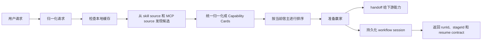

# skills-broker

[](https://github.com/monkeyin92/skills-broker/actions/workflows/ci.yml)
[](./LICENSE)
[](https://github.com/monkeyin92/skills-broker/stargazers)

[English](./README.md) | **简体中文**

> 别再让用户去记 skill 名字。  
> 让用户只说结果，让 broker 去找能力。

`skills-broker` 是一个面向 **Claude Code**、**Codex**、**OpenCode** 这类代码型 agent 宿主的开源 **skill router**、**MCP router**、**agent capability broker**。**Claude Code、Codex、OpenCode 现在已经共享完整的发布态 lifecycle 与 proof/reuse parity。**

它站在“用户请求”和“能力生态”之间，负责：

- 判断这次请求到底需不需要 skill 或 MCP
- 能复用本地已验证赢家时优先复用
- 需要外查时去选出最合适的候选
- 把候选准备到“宿主可调用”的状态
- handoff 完成立刻退场

今天最清楚的第一条使用路径是 **website QA**：

- 先让宿主去 QA 一个网站
- 如果还没装对应赢家，就让 broker 返回 `INSTALL_REQUIRED`
- 安装后重试，再把 verify 和 cross-host reuse 跑通

如果你也被这个问题困扰，给项目点个 star 会很有帮助。

## 这个项目解决什么问题

现在的 skills 生态增长很快，但使用方式还是反着来的：

- 用户得先记住工具名，而不是先表达想要的结果
- 团队会一点点装越来越多的 skills
- 上下文被大量低频能力污染
- agent 常常默认能力已经安装在本地
- “发现能力”和“执行能力”还是割裂的

最后就会出现一个非常典型的现象：

**找 skill 的成本，经常比用 skill 还高。**

## 这个项目的核心想法

`skills-broker` 不是另一个 marketplace。

它是下面三者之间缺失的 **决策层**：

- 用户到底想解决什么
- 当前宿主到底能调用什么
- 当前生态里到底有什么能力可选

用户说：

> “把这个网页转成 markdown”

broker 决定：

1. 这个请求属于哪个任务族
2. 能不能直接复用本地已经验证过的赢家
3. 如果不能，该从 skill 和 MCP 候选里选哪个
4. 怎样把它准备到可调用状态
5. 到什么时机应该停止 broker、自觉 handoff

这样用户关心的是结果，不是工具目录。

## 为什么有人会关心它

### 没有 broker 时

- 用户自己翻目录
- agent 猜 skill 名
- 本地安装越来越多
- 一个 discovery source 出错可能整条链都坏
- 每次请求都要重新从头发现

### 有 broker 之后

- 用户只表达意图
- broker 先查本地缓存
- skills 和 MCP 都被统一成同一种决策模型
- 当前宿主是硬约束，不会瞎选
- handoff 明确，边界清晰

## 手动找能力 vs `skills-broker`

| 问题 | 手动找 skill / MCP | 使用 `skills-broker` |
|---|---|---|
| 起点 | 用户先翻目录 | 用户先表达结果 |
| 选能力 | 人来猜 | broker 来排 |
| 本地复用 | 通常靠经验 | cache-first 内建 |
| skill 与 MCP | 两套心智模型 | 统一成 `Capability Card` |
| 失败容错 | 很容易整条断掉 | 单源失败可降级继续 |
| 上下文成本 | 往往越装越多 | 偏向最少且足够好的能力 |
| 用户注意力 | 工具名和安装细节 | 任务结果 |

## v0 现在能做什么

当前版本故意做得很窄：

> **先打穿 broker auto-router 的一个小湖：** markdown 转换、broker-first 的需求分析 / QA / investigation 路由，以及第一条 broker 自管的 `idea-to-ship` workflow。

在这个小湖里，**website QA 是今天最适合当默认入口的 lane**。requirements analysis 和 investigation 继续保持 supported maintained families，但第一条该教用户去试的路径应该先是 QA。

第二条已经证明的 family 是 **web markdown**。它应该排在 website QA 之后作为下一条 operator loop，而不是和 QA 并列抢第一步。
下一条已经证明的 family 是 **social markdown**。它应该排在 web markdown 之后作为另一条 maintained loop，而不是重新变成一个新的第一步。
QA-first family loop：先 website QA，再 web markdown，最后 social markdown。
当 website QA proof 已成立后，下一条该跑的 proven loop 是 web markdown；完成之后，social markdown 是再下一条。
`doctor` 现在会直接输出一份 QA-first family-loop packet：包含 website QA adoption，以及 web markdown / social markdown 的 freshness、reuse 与按顺序排列的 next action。
Capability growth 的 next action 继续归 broker 所有：install、verify、rerun、refresh metadata，或 prefer verified winner。
`doctor` 现在会直接输出一份 capability growth packet：provenance、install_required、verification、repeat usage、cross-host reuse、degraded/failed counts 与 next action。

v0 当前包含：

- 一套跨宿主共享的 broker envelope
- broker 侧的归一化能力：
  - `web_content_to_markdown`
  - `social_post_to_markdown`
  - 原始 `requirements_analysis`
  - 原始网站 `qa`
  - 原始 `investigation`
  - `capability_discovery_or_install`
- `idea-to-ship` 的 broker 自管 workflow 启动与恢复
- 双来源发现
  - host skill catalog
  - MCP-backed capability candidates
- 统一的 `Capability Card` 归一化模型
- cache-first 路由
- 每日首次使用刷新 + 硬 TTL
- 可解释、可复现的确定性排序
- `runId` + `stageId` + `decision` 的 workflow runtime
- 显式的 stage artifact / gate contract
- 对普通下游能力走 prepare + handoff，对 broker 自管 workflow 走持久化 session + 返回当前 stage 状态
- `unsupported` / `ambiguous` / `no-candidate` 的结构化 outcome
- `stale stage`、缺失/非法 artifacts、`install_required`、`ship gate` 阻塞等 workflow 失败结果
- 可迁移的 Claude Code 插件安装产物
- 已发布的 `npx skills-broker` lifecycle CLI
- 共享 broker home 的 install / update / remove / doctor 链路
- Claude Code、Codex、OpenCode 薄宿主壳支持
- Claude Code、Codex、OpenCode 之间的跨宿主 cache 复用
- verified downstream manifest 现在也是 advisory discovery source，已经验证过的 broker-owned downstream winner 不必完全依赖当前 catalog 才能再被找回
- CI 和 live discovery smoke 覆盖
- capability-query 主导的 host catalog / MCP / workflow 发现，所以结构化 broker 请求不再那么依赖 legacy `intent` 的严格相等
- MCP registry 现在会带 validated metadata 与 query coverage evidence，所以 broker 在解释 MCP 选择时能说清 version、transport、endpoint count 和命中原因，同时又不会让 advisory registry 候选压过已安装的本地 winner
- modern web / social / capability discovery 请求走 query-first 归一化，所以 `capabilityQuery` 现在承载主要 broker 语义，`intent` 更多只保留为兼容层标签
- shared home 会持久化 routing trace，`skills-broker doctor` 现在会按 `structured_query`、`raw_envelope`、`legacy_task` 输出最近命中率 / 误路由率 / fallback 率汇总
- repo 只要接入 canonical `STATUS.md`，`skills-broker doctor` 还可以做 proof 校验，并在 strict 模式下区分 `shipped_local` 和 `shipped_remote`

这一版也补宽了 free-form product idea 的命中面，所以用户用更自然的一句话描述产品想法时，更容易直接进入 broker 自管的 `idea-to-ship` workflow，而不是掉回 unsupported。

这次 packet 还有一条必须说真话的边界：catalog 里现在仍然保留了 `capability-discovery` 这个 helper identity，但它今天代表的是 broker 引导的 discovery/install helper contract，而且实现形态是一个本地 helper skill，不是完整 broker 自管的 acquisition workflow。v0 里已经发货的 broker 自管 workflow 现在是 `idea-to-ship` 和 `investigation-to-fix`。

这不是为了“什么都支持”。  
v0 的目标是证明：在一个具体任务上，broker 可以比人手动翻 skills 更准确地选到并准备好正确能力。

**当前产品阶段：**在保持 adoption health 绿色的前提下，把 discovery/install 做成更强的复用飞轮，继续扩展有证据支撑的 capability surface，并用显式的 CI trust guardrails 保护现在已经 full-parity 的 Claude Code / Codex / OpenCode 运行面。这个 packet 最想先说清楚的默认入口，仍然是 website QA。

宿主只选择 `broker_first` / `handle_normally` / `clarify_before_broker`；具体 QA winner 仍由 broker 决定。

**迁移说明：**`capabilityQuery` 现在是唯一应该让调用方依赖的公开请求契约。`intent` 还在，但现在只作为内部兼容层标签保留给 supplier adapter、显式的晚期 tie-break、maintained-family proof rail，以及 legacy workflow/session 连续性。

**这个 packet 的 DX bar：**把支持矩阵说清楚，把 first routed success 压到 5 分钟内，并让 operator-facing 错误至少说清“出了什么问题、原因是什么、下一步看哪里”。

## 架构一眼看懂



## 共享 Broker Home

共享 home 架构已经开始在这个仓库里落地：

- `skills-broker` 只安装一次
- 共享 broker home 固定在 `~/.skills-broker/`
- Claude Code、Codex、OpenCode 都只接一个很薄的 host shell
- capability cards、路由历史、缓存和运行时状态跨宿主共享

这意味着用户换宿主时，不应该把能力发现质量清零。

如果某个网页转 markdown 的赢家已经在 Claude Code 中被验证过，后续切到 Codex 或 OpenCode 时，broker 应该尽量复用同一份共享知识，而不是重新从零发现。

这个模型下，产品级统一维护命令定为：

```bash
npx skills-broker update
```

它的职责应该是：

- 更新 `~/.skills-broker/` 下的共享 runtime 和配置
- 重新扫描支持的宿主
- 给新检测到的宿主补装薄适配层
- 修复已有但损坏或缺失的宿主壳
- 默认保留 cache、capability history 和成功路由记录

## 当前支持矩阵

- 现在支持：Claude Code、Codex、OpenCode
- Claude Code、Codex、OpenCode 现在已经共享完整的发布态 lifecycle 与 proof/reuse parity。
- 发布态 lifecycle 命令统一为：npx skills-broker update / npx skills-broker doctor / npx skills-broker remove
- 三个支持宿主现在已经共享同一套 shared broker home、thin host shell、proof/reuse state 与发布态 lifecycle 合同。
- v0 当前不支持：其它宿主

`docs/superpowers/specs/2026-04-22-third-host-thin-shell-readiness.md` 现在更多是已经落地的 parity 工作记录，以及 future host expansion 的 guardrail 参考。

## 它和别的东西本质上有什么不同

`skills-broker` **不是**：

- 一个 skill marketplace
- 一个网页抽取引擎
- 一个新的聊天产品
- 一个把工具名写死在 prompt 里的脚本

它真正负责的是 **运行时能力决策**。

这点很关键，因为最难的从来不是“把工具放进仓库里”，而是：  
**在正确的时机，为正确的宿主，为正确的任务，选到正确的能力，而且不让用户自己变成目录专家。**

## 快速安装和使用

如果你今天只跑一条发布态主路径，就跑这一条：先装 shared broker home，然后让宿主去 QA 一个网站，需要时同意 `INSTALL_REQUIRED`，再把同一个请求重跑一遍，最后用 `doctor` 看证据。

这个 packet 把 website QA 当成 QA default-entry loop，也是 operator 最快看到 doctor truth 的路径。其他 maintained lanes 继续支持，但不该先试。

宿主只选择 `broker_first` / `handle_normally` / `clarify_before_broker`；具体 QA winner 仍由 broker 决定。

### 1. 初始化或刷新共享 broker home

```bash
npx skills-broker update
```

使用 `npx skills-broker update` 可以初始化或刷新共享 broker home，接上薄宿主壳，并让 Claude Code、Codex、OpenCode 复用同一份路由缓存。当前发布态 lifecycle CLI 已经管理这三个支持宿主。裸跑 `npx skills-broker` 目前等价于 `npx skills-broker update`，所以脚本和文档里应该把子命令写全。`npx skills-broker update --repair-host-surface` 现在会把 peer surface 修复写成 typed audit event，`npx skills-broker update --clear-manual-recovery --host <host> --marker-id <id> ...` 则是修复失败后给 operator 用的显式解封路径。`npx skills-broker doctor` 用来只读诊断环境，如果 shared home 里已经有 routing trace，还会顺手汇总最近的 broker 命中率 / 误路由率 / fallback 率，同时把 acquisition memory 和 verified downstream manifests 作为两条独立 advisory discovery source 打出来，显示 broker-first gate 新鲜度和 manual recovery blocker；如果当前 repo 接入了 canonical `STATUS.md`，它还可以顺手校验 shipped proof，并在 strict 模式下区分 `shipped_local` 和 `shipped_remote`，适合挂到 CI gate。`npx skills-broker remove` 默认只拆卸受管宿主壳而不删除共享历史，`npx skills-broker remove --reset-acquisition-memory` 只清 advisory acquisition-memory store，`npx skills-broker remove --purge` 会把共享 broker home 一起清掉。

`update` 和 `doctor` 现在还会输出一个一等公民的 `adoptionHealth` verdict：

- `green`：至少有一个受管宿主是干净的，而且已知 proof surface 没有发红
- `blocked`：安装物存在，但有明确 blocker，比如 competing peers、manual recovery、gate 漂移，或者显式指定的宿主壳 / shared home 缺失
- `inactive`：还没有安装任何受管宿主壳，但当前也没有损坏状态

默认情况下，`update` 会先按官方根目录检测宿主，再决定是否写入：

- Claude Code：先看 `~/.claude`，检测到后把薄壳写到 `~/.claude/skills/skills-broker`
- Codex：先看 `~/.codex`，检测到后把薄壳写到 `~/.agents/skills/skills-broker`
- OpenCode：先看 `~/.config/opencode` 或 `~/.opencode`，检测到后把薄壳写到 `<detected-root>/skills/skills-broker`

如果没有检测到官方根目录，CLI 会明确提示，并告诉你用 `--claude-dir`、`--codex-dir` 或 `--opencode-dir` 指定自定义目录。默认根目录缺失会让 adoption health 保持在 `inactive`；如果你显式指定了一个缺失的宿主壳路径，则会出现带名字的 `blocked` verdict。

### 2. 先跑一遍 website QA 的 install-required -> verify -> reuse 闭环

这是 discovery/install 飞轮在发布态薄宿主壳上真正要证明自己的地方。

1. 在 Claude Code、Codex 或 OpenCode 里，先从一个 website QA 请求开始，比如 `QA 这个网站 https://example.com`。
2. 如果当前最佳 package 还没装，宿主应该收到一个 `INSTALL_REQUIRED` outcome，同时带 `hostAction=offer_package_install`。这和真正的 `NO_CANDIDATE` 不一样：前者表示 broker 已经找到了赢家，只是在要求宿主先安装。
3. 同意安装后，把同一个请求再发一次。broker 这次应该验证已安装赢家并直接 handoff，而不是重新掉回 fallback。
4. 跑 `npx skills-broker doctor`，确认 shared home 已经开始记录 reuse，也能看见后续可 replay 的 verified downstream manifests。

requirements analysis 和 investigation 仍然是受支持的 maintained family，只是它们不该和 QA 一起抢 README 里的第一步。

web markdown 仍然是下一条已经被证明的 lane，但前提是 QA default-entry loop 和 doctor truth 已经先讲清楚。

当这条默认入口闭环已经清楚之后，第二条已经证明 install / verify / reuse 的 family 是 **web markdown**：可以直接发 `turn this webpage into markdown https://example.com/post` 这类请求，需要安装时同意安装，然后重跑同一个请求，再从另一个 host 重复一次，确认 cross-host reuse 也成立。

下一条已经证明的 family 是 **social markdown**：可以直接发 `save this X post as markdown https://x.com/example/status/1` 这类请求，需要安装时同意安装，然后重跑同一个请求，再从另一个支持宿主重复一次，确认同样的 cross-host reuse 合同也成立。
当 website QA proof 已成立后，下一条该跑的 proven loop 是 web markdown；完成之后，social markdown 是再下一条。

第一次被 install 挡住时，宿主侧 outcome 应该类似：

```json
{
  "outcome": {
    "code": "INSTALL_REQUIRED",
    "hostAction": "offer_package_install"
  }
}
```

在第一次跨宿主的重复使用发生后，`doctor` 里应该能看到类似：

```text
Website QA acquisition proof: repeat_usage=1, cross_host_reuse=1
Website QA repeat-usage proof: confirmed (at least one repeated successful route recorded)
Website QA cross-host reuse proof: confirmed (first reuse across hosts recorded)
```

如果你之后把 acquisition memory 清掉，另一个 host 仍然应该能靠这份 verified downstream manifest 恢复出 `INSTALL_REQUIRED`，而不是一路退化回 `NO_CANDIDATE`。

`doctor` 现在会直接输出一份 website QA adoption packet：近期 routing evidence、freshness，以及拆开的 repeat usage / cross-host reuse proof state。
`doctor` 现在会直接输出一份 QA-first family-loop packet：包含 website QA adoption，以及 web markdown / social markdown 的 freshness、reuse 与按顺序排列的 next action。

如果你只想把这份 advisory memory 清掉，再从头重跑这个闭环，可以用：

```bash
npx skills-broker remove --reset-acquisition-memory
```

### 3. 用 `doctor` 验证 operator 路径

```bash
npx skills-broker doctor --strict
```

这是在 QA loop 跑完后，确认共享 home 安装是否真的生效的最快路径。这个 packet 现在只要求三件事：

- 你能用一条命令看出 adoption health 是 `green`、`blocked` 还是 `inactive`
- 支持矩阵已经翻到 Claude Code、Codex、OpenCode，而且 full lifecycle / proof parity 的 truth 在 operator-facing 文案里保持一致
- 宿主仍然只解释 coarse broker-first boundary，而不是先替 broker 选具体 QA winner
- `doctor` 会直接显示 website QA adoption packet，包括 freshness，以及下一步缺的是 repeat usage 还是 cross-host reuse proof
- `doctor` 也会直接显示 QA-first family-loop packet，包括 web markdown / social markdown 的 freshness、reuse 与按顺序排列的 next action
- operator-facing 失败能指出先去检查哪里

### 4. 用显式目录试跑共享 home

```bash
npx skills-broker update \
  --broker-home /tmp/.skills-broker \
  --claude-dir /tmp/.claude/skills/skills-broker \
  --codex-dir /tmp/.agents/skills/skills-broker \
  --opencode-dir /tmp/.config/opencode/skills/skills-broker
```

它会：

- 把共享 broker runtime 构建到 `/tmp/.skills-broker`
- 接上一个 Claude Code 薄壳
- 接上一个 Codex 薄壳
- 接上一个 OpenCode 薄壳
- 让三个宿主复用同一份 broker cache 和路由历史

如果你要接到自动化或 CI，所有 lifecycle 命令也都支持 `--json`。对于已经发货的 family-proof loops，推荐把默认入口 lane 读成 `familyProofs.website_qa.verdict`，把第二条已证明 lane 读成 `familyProofs.web_content_to_markdown.verdict`：

- `blocked`：proof rail 不可读，或者这条闭环当前还不可信
- `in_progress`：闭环已经开始，但 install -> verify -> repeat usage -> cross-host reuse 还没有完整证明
- `proven`：已经拿到 cross-host reuse 级别的闭环证明

如果调用方还想看细节，可以继续读 `familyProofs.<family>.phase` 和 `familyProofs.<family>.proofs`。其中 `repeat_usage_pending` 表示下一步缺的是“同一个请求再成功跑一次”，`cross_host_reuse_pending` 表示下一步缺的是“换一个支持宿主再成功跑一次”。

### 5. 为本地开发克隆仓库并安装依赖

```bash
git clone https://github.com/monkeyin92/skills-broker.git
cd skills-broker
npm ci
```

### 6. 先做预检，再验证本地 checkout

```bash
# 与 CI 对齐的本地基线：Node 22 + npm ci + npm run build + npm test
npm run verify:local
```

如果你只想先诊断环境、不启动整套验证，运行 `npm run verify:local -- --check-only`。如果预检报告 npm / Rollup / Vitest 依赖损坏，先执行 `npm ci`，再重新跑 `npm run verify:local -- --check-only`，确认健康后再执行 `npm run verify:local`。

`verify:local` 和 CI trust guardrails 故意回答的是两类不同问题。`npm run verify:local` 只检查这台机器是否健康到足以跑 Node 22 + build + test 基线；CI 则运行 `npm run ci:blind-spot`、`npm run test:ci:narrative-parity`，再加上 strict repo-scoped doctor gate，专门捕获支持宿主、maintained/proven lanes、workflow coverage 和 operator-facing narrative truth 的漂移。

如果要消费 repo-owned 的 shipping truth，发布前运行 `npm run release:gate -- --json`。它会把 blind-spot report、focused narrative parity suite 与 strict repo-scoped doctor gate 收口成一条 canonical verdict，并直接给出 failing rail、evaluated shipping ref 与 remote freshness diagnostics。等 shipping ref 已经包含 `HEAD` 之后，再运行 `npm run release:promote -- --ship-ref origin/main --json`，只把 canonical `STATUS.md` 里真正 eligible 的 `shipped_local` 项提升成 `shipped_remote`。这两个命令刻意保持 repo-local，不会把发布态 lifecycle CLI 扩展到 `npx skills-broker update / doctor / remove` 之外。

### 7. 安装仓库内的 Claude Code 本地包

```bash
./scripts/install-claude-code.sh /absolute/path/to/claude-code-plugin
```

这个命令会生成一个自包含的本地插件目录，里面包括：

- `.claude-plugin/plugin.json`
- `skills/skills-broker/SKILL.md`
- `config/*.json`
- `dist/*.js`
- `package.json`
- `bin/run-broker`

这条链路是 **仓库内的 Claude Code 开发路径**，不是当前主推的发布态安装入口。

### 8. 在 contributor 路径上拿到 first routed success

```bash
/absolute/path/to/claude-code-plugin/bin/run-broker \
  '{"requestText":"turn this webpage into markdown: https://example.com/article","host":"claude-code","invocationMode":"explicit","urls":["https://example.com/article"]}'
```

预期输出是一段 JSON，里面包含：

- 被选中的 winner
- handoff envelope
- 调试信息

## 典型使用场景

- 用户只说“把这个网页转成 markdown”，而不是先手动挑 skill
- 相似请求优先复用本地成功过的能力
- 用同一套模型比较 host-native skill 和 MCP-backed candidate
- 在保持 broker 很窄很明确的前提下，实验动态能力发现

## 为什么这种方式更强

- **发现成本更低**  
  用户描述任务，不需要记 skill 名。

- **上下文更干净**  
  broker 会优先选择“最少且足够好”的能力。

- **失败容忍度更高**  
  一个 discovery source 坏掉，不必拖死整条路由链。

- **宿主感知路由**  
  当前宿主可用是硬过滤，跨宿主兼容只是额外加分。

- **边界清楚**  
  broker 不会擅自追加用户没要求的总结、摘要或解释。

- **安装产物可迁移**  
  生成出来的 Claude Code 插件目录可以脱离原始源码 checkout 独立移动。

## 谁会适合用它

如果你符合下面任一情况，这个项目大概率对你有价值：

- 你现在就在 Claude Code、Codex 或 OpenCode 之上做 agent tooling
- 你受够了 skill 越装越多、上下文越拖越长
- 你在实验 MCP-backed capability ecosystem
- 你希望 agent 更像“面向结果”，而不是“面向工具名”
- 你在设计动态能力发现的 runtime layer

## 当前边界

这个仓库当前优先优化的是：

- 先打穿一个小而清楚的 routed lake，而不是一上来覆盖开放域
- 今天已经支持三个薄宿主：Claude Code、Codex、OpenCode
- 先把这个小湖里的一个默认入口讲清楚：website QA first
- 先把几条显式 broker-first lane 做扎实：markdown 转换、需求分析 / QA / investigation，以及第一条 workflow recipe
- 默认依赖 fixture 做稳定本地测试
- 路由逻辑尽量保持小、明确、易审计

当前还**没有**提供：

- 超出 Claude Code、Codex、OpenCode 当前三宿主之外的 full parity
- 超出“明显外部能力请求”的宽泛 auto-routing
- 广义开放域任务覆盖
- 默认走实时联网 discovery 的运行时
- 在真实宿主会话里足够稳定的 broker-first 命中率

## Roadmap

接下来大概率会推进：

- 提升 Claude Code 和 Codex 真实会话里的 broker-first 命中率
- 补更多证据，证明 website QA-first 的入口表述真的会带来重复使用
- 给已发货的 lifecycle / proof truth 补上更硬的 CI guardrails
- 扩展到 OpenCode 之外的更多宿主
- 增加更多任务族，而不只限于当前这组 markdown + requirements / QA / investigation 小湖
- 增加更多 broker 自管 workflow，而不只限于第一条 `idea-to-ship` 主链路
- 接入更强的 live registry 能力
- 增加更强的附件感知归一化和澄清式 follow-up

## 仓库结构

```text
src/
  broker/                 路由、排序、prepare、handoff
  core/                   请求类型、能力卡片、缓存策略
  hosts/claude-code/      Claude Code adapter 和 installer
  hosts/codex/            Codex 薄壳 adapter 和 installer
  hosts/opencode/         OpenCode 薄壳 adapter 和 installer
  shared-home/            共享 broker home 的 install / update 流程
  sources/                skill / MCP discovery adapter
tests/
  cli/                    CLI 合约测试
  core/                   request 和 cache 测试
  broker/                 排序、prepare、handoff 测试
  integration/            broker 主链路集成测试
  e2e/                    shared-home 与跨宿主 smoke test
config/
  host-skills.seed.json
  mcp-registry.seed.json
scripts/
  install-claude-code.sh
  update-shared-home.sh
```

## 欢迎贡献

欢迎 issue、discussion、PR。

特别值得贡献的方向：

- lifecycle / proof truth 的 CI guardrail 加固
- OpenCode 之外的更多 host shell
- live discovery 集成
- 新的任务族
- 更丰富的 ranking signals
- 更顺手的安装和打包体验
- 示例、文档和 demo

提交时可直接使用模板：

- [Bug 反馈模板](https://github.com/monkeyin92/skills-broker/issues/new?template=bug_report.md)
- [功能请求模板](https://github.com/monkeyin92/skills-broker/issues/new?template=feature_request.md)
- [Pull Request 模板](./.github/pull_request_template.md)

提交 PR 前建议先跑：

```bash
npm run build
npx vitest run
```

如果你改的是行为逻辑，建议在 PR 里顺手说明：

- 用户问题是什么
- 为什么这部分行为应该由 broker 负责
- 改动后 handoff 边界是否依然干净

## 常见问题

### 它是一个 marketplace 吗？

不是。它是一个 broker 和 routing layer。

### 它已经能直接生产使用了吗？

还没有。现在仍然是一个聚焦型 v0，但已经有共享 broker home、已发布的 lifecycle CLI、Claude Code、Codex、OpenCode 三个 full-parity 薄宿主壳、已经发货的 adoption-proof rail，以及一个小而清楚的 routed lake。当前阶段重点是在不让真实宿主 auto-routing 回退的前提下，把 discovery/install 做成更强的复用飞轮，同时补强 capability surface 和 CI trust rail。如果你今天只想走一条最清楚的 first-use path，就先从 website QA 开始。

### 为什么最先落的是 Claude Code 和 Codex，OpenCode 现在处于什么位置？

因为产品需要先在真实的代码型宿主上证明“一个共享 broker 契约可以跨宿主工作”，再往更多宿主扩。Claude Code 和 Codex 是这条路径上的前两个宿主；OpenCode 现在已经是已发货的第三个薄宿主壳，而且已经纳入同一套 full lifecycle / proof parity 合同。

### Claude Code、Codex、OpenCode 会共享同一份能力知识吗？

会。仓库里现在已经有一条 shared-home 流程，Claude Code、Codex、OpenCode 可以复用同一份 capability cache、history 和 runtime，而不是各自维护一份孤岛副本。

### `npx skills-broker update` 以后负责什么？

它现在就是共享 home 模型下的正式维护命令。它负责更新共享 runtime、重新扫描宿主、补装或修复薄适配层，并且默认不清空已有 broker 知识。

### 为什么不直接多装几个 skill？

因为 skill 装得越多，选择成本、上下文成本和冲突风险通常都会一起上升。broker 的价值恰恰是“少选、选准”，不是“越装越多”。

### 它和 MCP registry 的区别是什么？

registry 告诉你“世界上有什么”；`skills-broker` 决定的是“当前这个宿主、这个任务、这个时刻该用什么”。现在它的 MCP source 也会带 validated 的 version / transport / query-coverage metadata，所以 broker 能解释为什么选了这个 MCP，同时又不会让 advisory registry 候选压过已安装的本地 winner。

### 它能在没有实时联网 discovery 的情况下工作吗？

可以。v0 默认依赖本地 seed 和 fixture 数据跑开发与测试链路。

## License

[MIT](./LICENSE)
